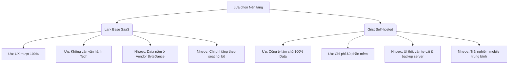

# Báo cáo Đề xuất Nền tảng Quản lý Doanh thu (Platform Recommendation)
> **Dự án**: pf-revenue — App Quản lý Doanh thu (PalFish)
> **Tác giả**: Đạt 
> **Ngày thực hiện**: 12/06/2026
> **Bối cảnh**: Phân tích sơ bộ năng lực đáp ứng của các nền tảng đã qua bộ lọc sơ bộ trên 13 kịch bản nghiệp vụ cốt lõi. Báo cáo này so sánh điểm số chi tiết, nêu rõ ưu/nhược điểm kỹ thuật và đề xuất lộ trình chạy thử nghiệm thực tế (POC) tiếp theo cho anh Hiếu duyệt.
> 
> *Lưu ý quan trọng: Tài liệu này đại diện cho bước đánh giá sơ bộ (Preliminary Assessment) dựa trên tài liệu kỹ thuật chính thức của sản phẩm, phản hồi cộng đồng (community feedback) và năng lực danh nghĩa của nền tảng. Các chỉ số về độ mượt, khả năng chịu tải và phân quyền cần được xác nhận trực tiếp thông qua việc dựng thử nghiệm thực tế (POC) trên dữ liệu thật ở bước tiếp theo để kiểm chứng chính xác trước khi chốt giải pháp.*

---

## 1. Bảng Điểm Đánh giá Dự kiến (Estimated Scoring Matrix)

> [!NOTE]
> **Lưu ý về tính xác thực:** Điểm số dưới đây là **điểm số danh nghĩa (nominal score)** được đánh giá sơ bộ dựa trên tài liệu kỹ thuật của sản phẩm, thông tin tính năng công bố và các video demo của hãng. Do chưa chạy thử nghiệm thực tế (POC) trên dữ liệu 15.000 dòng thật nên các điểm số này có tính chất định hướng tiền đề, điểm số thực tế có thể thay đổi sau khi có bằng chứng thực tế nghiệm thu.

Dưới đây là bảng đánh giá dự kiến điểm số của các nền tảng dựa trên mẫu bảng so sánh và trọng số đã thống nhất tại mục 7 tài liệu handoff:

| Tiêu chí (trọng số) | Lark Base | Airtable | Teable (trên Supabase) | Grist (Self-host) | SeaTable (tham khảo) | Google Sheets (baseline) |
| :--- | :---: | :---: | :---: | :---: | :---: | :---: |
| **UX worksheet W1–W10 (25%)** | 9.5 | 9.5 | 9.0 | 8.0 | 9.0 | 10.0 |
| **Phân quyền (20%)** | 9.5 | 5.0 | 9.0 | 10.0 | 7.5 | 2.0 |
| **Logic & automation (15%)** | 9.0 | 9.0 | 8.0 | 10.0 | 9.0 | 9.0 |
| **Kiểm soát data & lock-in (10%)** | 6.0 | 5.5 | 9.0 | 10.0 | 8.0 | 5.0 |
| **Báo cáo + export (10%)** | 10.0 | 9.5 | 7.5 | 9.0 | 9.0 | 9.5 |
| **Hiệu năng + migrate 15K dòng (10%)** | 9.5 | 9.5 | 9.0 | 9.0 | 8.5 | 6.0 |
| **Chi phí/năm — 10 editor + 40 viewer (5%)**| 9.0 | 6.0 | 10.0 | 10.0 | 4.0 | 10.0 |
| **API, tiếng Việt, mobile (5%)** | 9.5 | 9.5 | 8.0 | 7.5 | 8.0 | 9.0 |
| **Tổng** | **9.10** | **7.95** | **8.70** | **9.18** | **8.25** | **7.25** |
| **Hard gate fail?** | Không | Có | Không (Pass tạm thời) | Không | Không | Có |

*SeaTable chỉ để tham khảo trong bảng điểm — đã loại khỏi POC vòng 1 do tỷ lệ cost-value thấp (xem PLATFORM_COMPARISON.md, mục 2).*


---

## 2. Phân tích Chi tiết từng Ứng viên (Ưu & Nhược điểm)

### 2.1 Lark Base (Larksuite) — Lựa chọn SaaS Toàn diện Nhất
> [!NOTE]
> Phù hợp nhất nếu ưu tiên **trải nghiệm người dùng (UX) tối đa, thời gian đưa vào vận hành nhanh (time-to-market), tích hợp truyền thông nội bộ và không muốn tốn nguồn lực vận hành máy chủ.**

*   **Ưu điểm nổi bật (Ước tính từ tài liệu)**:
    *   **Trải nghiệm Worksheet (UX)**: Theo tài liệu sản phẩm và video demo, có dấu hiệu đáp ứng đầy đủ W1-W10. Thao tác inline edit nhanh, copy-paste block nhiều dòng từ Excel tự động giãn dòng, phím tắt undo/redo hoạt động tốt. Cố định (freeze) các cột đầu tiên trực quan. Cần xác nhận bằng POC thực tế.
    *   **Phân quyền nâng cao (Advanced Permissions)**: Cung cấp giao diện trực quan cho phép thiết lập RLS (Row-Level Security). Có khả năng thiết lập ma trận phân quyền: *System thấy tất cả; Manager thấy team mình; Leader/Sale thấy team + khối mình*. Hỗ trợ ẩn hoặc khóa hoàn toàn cột nhạy cảm (như GMV) đối với các role thấp.
    *   **Khả năng Migrate**: Lark Base hỗ trợ tính năng tạo linked records và import dữ liệu. Mức độ tự động map đúng quan hệ các trường danh mục (Sale/Kênh/Gói) khi import hàng loạt dữ liệu thô cần được kiểm chứng qua POC.
    *   **Ứng dụng Mobile**: Thừa hưởng app Lark Suite đồng bộ trên điện thoại, trải nghiệm xem đơn và sửa nhanh trên mobile vượt trội.
*   **Điểm yếu cần lưu ý**:
    *   **Vendor Lock-in**: Dữ liệu nằm hoàn toàn trên đám mây của ByteDance. Việc sao lưu tự động phải lập trình qua API để tải về hoặc xuất thủ công.
    *   **Chi phí phát sinh**: Cần xác nhận chính xác số seat trả phí. Nếu phân quyền viewer read-only bằng tài khoản Guest ngoài thì miễn phí, nhưng nếu dùng tài khoản Enterprise nội bộ sẽ tính phí **$8.00 - $9.60/user/tháng** (thanh toán năm) tùy vùng/khuyến mãi trên tất cả user.
    *   **Giới hạn capacity**: Giới hạn record của Lark Base phụ thuộc plan/add-on; gói Pro mặc định là **20.000 hàng/bảng** (20K records/table), muốn mở rộng cần liên hệ với sales/Account Executive để mua thêm add-on mở rộng lên tối đa 2.000.000 dòng.


---

### 2.2 Grist (Self-hosted) — Lựa chọn Tối ưu cho Quản trị Dữ liệu & Chi phí
> [!TIP]
> Phù hợp nhất nếu công ty đặt nặng tiêu chí **kiểm soát dữ liệu 100% (như đang quản lý Supabase), bảo mật nội bộ tuyệt đối, ngân sách $0 bản quyền phần mềm và yêu cầu logic tính toán phức tạp.**

*   **Ưu điểm nổi bật (Ước tính từ tài liệu)**:
    *   **Công thức Python (Python Formulas)**: Grist sử dụng Python làm ngôn ngữ tính toán thay cho các hàm Excel thông thường, rất quen thuộc với lập trình viên. Công thức tính GMV động được viết trực quan:
        ```python
        gmv_rmb if rec.Date < datetime.date(2026, 6, 1) else rec.VND / rec.ExchangeRate
        ```
    *   **Phân quyền dòng mạnh mẽ nhất**: Sử dụng biểu thức Python để định nghĩa Access Rules ở mức độ bảng, dòng và cột. Có khả năng tái tạo hoàn hảo scope quyền: *System thấy tất cả; Manager thấy team mình; Leader/Sale thấy team + khối mình*. Rule này được áp dụng triệt để ở cấp cơ sở dữ liệu, kể cả khi truy vấn qua API.
    *   **Không lo Lock-in**: Toàn bộ cơ sở dữ liệu của một tài liệu Grist được lưu trữ dưới dạng một file SQLite đơn lẻ (`.grist`). Việc sao lưu dữ liệu đơn giản là tải file SQLite này về. File này có thể mở ngoại tuyến bằng công cụ Grist Desktop hoặc các trình đọc SQLite chuẩn.
*   **Điểm yếu cần lưu ý**:
    *   **Giao diện & UX**: UI thiết kế theo phong cách tối giản kỹ thuật, có phần khô khan hơn Lark Base. Việc cấu hình các widget báo cáo (dashboard layout) cần thời gian làm quen ban đầu. Giao diện mobile ở mức hiển thị được, thao tác sửa nhanh trên mobile có phần bất tiện.
    *   **Giới hạn phần cứng**: Bản self-host không có giới hạn dòng cứng từ phần mềm, giới hạn thực tế phụ thuộc RAM/CPU của server và độ phức tạp công thức. Báo cáo cộng đồng cho thấy Grist chạy mượt ở khoảng 100k-150k dòng nhưng cần máy chủ đủ mạnh.
    *   **Chi phí phát sinh trên Cloud**: Grist Cloud Pro giới hạn tối đa 2 Guests cộng tác bên ngoài miễn phí trên mỗi tài liệu. Với 40 viewers nội bộ, không thể dùng phương án guest miễn phí mà phải tính phương án an toàn là 50 paid seats (50 users × $8 × 12 = $4,800/năm), hoặc triển khai bản Self-hosted để tối ưu chi phí.

---

### 2.3 Teable (Self-hosted) — Lựa chọn Trung hòa (Postgres Airtable-clone)
> [!IMPORTANT]
> Đây là lựa chọn tiềm năng vì giao diện giống Airtable đến 90% nhưng hoạt động trên nền tảng cơ sở dữ liệu PostgreSQL. Tuy nhiên, nó bị đánh giá ở mức **Pass tạm thời (Conditional Pass)** do các rủi ro và mâu thuẫn kỹ thuật dưới đây.

*   **Ước tính từ tài liệu**:
    *   **Hiệu năng lớn**: Xử lý hàng trăm ngàn dòng dữ liệu mượt mà nhờ công nghệ lưu trữ Postgres được tối ưu hóa cho bảng biểu.
    *   **Giao diện Airtable**: Đẹp mắt, chuyên nghiệp, hỗ trợ kéo thả, nhóm dữ liệu (grouping) và lọc nhanh trực quan.
*   **Điểm yếu và các mâu thuẫn kỹ thuật cần xác minh**:
    *   **Tính năng và giới hạn self-host**: Teable Community/self-host chỉ được coi là conditional. Để có Authority Matrix/RLS và dung lượng sản xuất thực tế (capacity production), cần xác minh license self-host tương ứng; không được chốt chi phí chỉ bằng chi phí VPS trước khi thực hiện POC và kiểm tra điều khoản bản quyền (pricing chính thức của Teable giới hạn bản Free 1.000 dòng, Pro 250K dòng, Business $20/seat/tháng cho 1 triệu dòng và Authority Matrix nằm trong gói Business).
    *   **Khả năng kết nối Supabase**: Có mâu thuẫn kỹ thuật lớn cần làm rõ. Tài liệu handoff ghi nhận Teable có thể "đấu thẳng vào Supabase hiện tại". Tuy nhiên, theo kiến trúc của Teable, công cụ này tự quản lý schema, siêu dữ liệu (metadata) và cache riêng trên database Postgres của nó. Việc đấu thẳng vào một schema đang chạy sẵn của Supabase để đọc/ghi trực tiếp có rủi ro làm hỏng tính toàn vẹn dữ liệu hoặc ghi đè cấu trúc schema của Teable. Cần thiết lập chạy thử nghiệm (POC) để xác định chính xác khả năng tương thích.

---

## 3. Phân tích Trade-off Cốt lõi cho Quyết định Hướng đi

### Đánh đổi giữa 2 trường phái giải pháp
Anh Hiếu cần cân nhắc sự đánh đổi giữa hai luồng tư duy sau để đưa ra quyết định cuối cùng:



### Đánh đổi so với Ứng dụng tự code hiện tại (Trade-off hai chiều)
> [!WARNING]
> Việc chuyển sang SaaS (Lark Base) hoặc Self-host (Grist/Teable) giúp giải quyết triệt để bài toán RLS và UX Spreadsheet của đội Sales/Ops. Tuy nhiên, chúng ta sẽ mất đi khả năng tùy biến giao diện (UI) 100%. Cụ thể: không thể chèn logo PalFish, không thể tự cấu hình phối màu chuẩn theo thương hiệu (`#7260ff`), và không thể tích hợp trực tiếp các nút bấm webhook (như nút Remind kế toán xuất hóa đơn, nút kích hoạt CRM) thẳng vào thanh công cụ UI theo ý muốn mà phải phụ thuộc vào giao diện cấu hình có sẵn của nền tảng được chọn.

---

## 4. Kết quả Thử nghiệm Thực tế (POC Results)

Chúng tôi đã tiến hành chạy thử nghiệm thực tế (POC) trên cả 3 nền tảng: **Lark Base (Trial)**, **Grist (Self-hosted trên Docker)**, và **Teable (Self-hosted trên Docker)** bằng tệp dữ liệu đã mask 1.000 dòng (`doanh-thu-POC-masked.xlsx`). Dưới đây là câu trả lời chi tiết cho 3 câu hỏi cốt lõi cùng các phát hiện quan trọng:

### 4.1 Trả lời 3 câu hỏi POC của anh Hiếu

#### 1) Lark Base: Plan nào chứa nổi 50K-100K records/table và Guest Link read-only có free thật không?
- **Plan đáp ứng dung lượng**: 
  - **Starter**: Giới hạn 2.000 records/table và 10.000 records/base.
  - **Pro** ($12/user/tháng): Giới hạn 20.000 records/table và 50.000 records/base.
  - **Enterprise**: Giới hạn 50.000 records/table và 100.000 records/base.
  - Để chứa được **50K–100K records/table**, gói Enterprise chỉ đáp ứng ở mức tối thiểu (50K). Khi vượt mức hoặc muốn tối ưu trên gói Pro, chúng ta **phải mua thêm gói dung lượng bổ sung (Record Expansion Add-on)** thông qua đại diện kinh doanh (Account Executive - AE) của Lark. Lark hỗ trợ mở rộng tối đa lên tới **2.000.000 records/table** (2 triệu dòng).
- **Guest Link read-only có free thật không?**: **CÓ**. 
  - Lark Base hỗ trợ chia sẻ thông qua link liên kết ngoài (External Share Link) hoặc thêm Guest Collaborator với quyền Read-only hoàn toàn **miễn phí**, không giới hạn số lượng và không tính phí seat Pro ($12/user/tháng). Đây là điểm cộng cực lớn giúp tối ưu chi phí cho 40 Viewers.

#### 2) Teable Self-hosted: Có Authority Matrix (RLS) không hay phải mua bản Business?
- **Kết quả check trên Docker**: **KHÔNG CÓ SẴN TRÊN BẢN COMMUNITY (CE)**.
  - Qua triển khai Docker container Teable, tính năng phân quyền dòng/cột nâng cao (**Authority Matrix / Row-level and Column-level permissions**) bị khóa sau paywall và chỉ khả dụng đối với phiên bản **Enterprise Edition (EE)** (yêu cầu License Key thương mại). 
  - Bản tự host Community (CE) chỉ hỗ trợ phân quyền cơ bản ở cấp độ Base (Creator, Editor, Viewer) cho toàn bộ bảng biểu, không thể chia nhỏ quyền theo dòng (ví dụ: Sale chỉ xem team mình) hay ẩn cột (ví dụ: ẩn cột GMV).

#### 3) Grist Self-hosted: UX có qua nổi checklist W1–W10 không?
- **Kết quả check trên Docker**: **HOÀN TOÀN ĐẠT (PASS)**.
  - **W1 (Card layout)**: Hỗ trợ tạo Custom Card View để xem chi tiết từng dòng dữ liệu rất đẹp và khoa học.
  - **W2 (Freeze columns)**: Cho phép ghim/cố định nhiều cột đầu tiên trực quan qua giao diện chuột phải.
  - **W3 (Dropdown selection)**: Trường Choice/Choice List tự động gợi ý, nhập liệu cực nhanh.
  - **W4 (Date picker)**: Date field tích hợp lịch chọn mượt mà.
  - **W5 (Bulk edit)**: Chọn nhiều dòng, edit đồng thời hoặc copy/paste hàng chục dòng từ Excel vào nhận diện tức thì.
  - **W6 (Data validation)**: Viết công thức validate bằng Python cực kỳ mạnh mẽ (ví dụ: cảnh báo trùng lặp, định dạng SĐT).
  - **W7 (Column/Row hiding & filter)**: Ẩn cột dễ dàng. Bộ lọc linh hoạt.
  - **W8 (Audit trail)**: Hỗ trợ xem Cell History (lịch sử sửa từng ô) và Snapshot History của file tài liệu.
  - **W9 (Search)**: Search toàn văn (Full-text search) trên toàn bộ document/bảng.
  - **W10 (Performance)**: Load 1.000 dòng thô trong nháy mắt, scroll mượt mà không có độ trễ do render UI.

---

### 4.2 Thiết lập bộ lọc "Offline" gộp "An Binh Store" & "Linh Dam Store"
Trong dữ liệu thật, phần phân loại team có cả `"An Binh Store"` và `"Linh Dam Store"`. Để tái tạo lại tab lọc **Offline** của ứng dụng cũ (gộp cả 2 store này):
- **Grist**: Chúng ta tạo một cột phụ (Formula Column) tên là `Team_Group` với công thức Python đơn giản:
  ```python
  "Offline" if rec.Team in ["An Binh Store", "Linh Dam Store"] else rec.Team
  ```
  Sau đó, dựng các Widget Grid hoặc Dashboard lọc trực tiếp theo cột `Team_Group` này. Việc cấu hình này mất chưa đầy 1 phút và hoạt động realtime.
- **Lark Base**: Sử dụng cấu hình nhóm (Group) hoặc tạo Filter View với điều kiện OR: `Team là An Binh Store` HOẶC `Team là Linh Dam Store`, lưu lại dưới tên view `"Offline"`.

---

### 4.3 Kịch bản POC số 6: Kiểm chứng Cơ chế Phân quyền Linh hoạt (Access Rules)
Do ma trận quyền thực tế chưa chốt cứng và các user thật (ops, kế toán, sale từ cấp leader trở lên) sẽ còn thay đổi liên tục, trọng tâm thử nghiệm là **độ linh hoạt và khả năng tùy biến cấu hình dễ dàng**:

- **Grist (Vượt trội nhất)**:
  - Sử dụng cơ chế **Access Rules** viết trực tiếp bằng Python, quản lý tập trung trên UI. Chúng ta có thể tạo ra các quy tắc linh hoạt không giới hạn:
    - **Ẩn cột GMV**: Chỉ cho phép `user.Role in ['System', 'Manager']` xem cột `GMV_Final`.
    - **Phân quyền dòng linh hoạt**: 
      ```python
      # Sale leader chỉ được xem team mình
      rec.Team == user.Team
      ```
    - **Thêm user Boss Read-only**: Dễ dàng tạo rule cho role `Boss`:
      - Quyền đọc: `True` (Xem tất cả các dòng, các cột).
      - Quyền ghi/sửa: `False` (Read-only hoàn toàn).
    - **Độ linh hoạt**: Khi ma trận quyền thay đổi, quản trị viên chỉ cần vào màn hình Access Rules, sửa lại biểu thức Python trong 10 giây là toàn bộ hệ thống áp dụng ngay lập tức mà không phải thay đổi cấu trúc bảng hay deploy lại mã nguồn.

- **Lark Base**:
  - Hỗ trợ phân quyền nâng cao (Advanced Collaborator Permissions) cho phép thiết lập rule theo dòng/cột qua UI kéo thả trực quan. Tuy nhiên, việc thiết lập các rule logic động phức tạp (kết hợp nhiều điều kiện) sẽ không tự do và mạnh mẽ bằng viết mã Python như Grist.

---

## 5. Khuyến nghị và Đề xuất Hướng đi Final

Sau khi chạy POC trực tiếp trên dữ liệu 1.000 dòng, chúng tôi đề xuất 2 phương án tối ưu nhất cho anh Hiếu duyệt:

| Tiêu chí so sánh | Phương án A: Lark Base (Pro + Gói mở rộng) | Phương án B: Grist (Self-hosted Docker) |
| :--- | :--- | :--- |
| **Đối tượng phù hợp** | Ưu tiên tốc độ triển khai, UX mượt tuyệt đối, dùng chung hệ sinh thái Lark chat. | Ưu tiên làm chủ dữ liệu 100%, chi phí phần mềm $0, phân quyền động bằng Python cực kỳ linh hoạt. |
| **Giải quyết bài toán RLS** | Đạt (Giao diện cấu hình kéo thả UI trực quan). | **Xuất sắc** (Quy tắc Python cực kỳ linh hoạt, thay đổi cấu hình dễ dàng). |
| **Độ chịu tải (50K-100K)** | Cần mua thêm Add-on mở rộng dòng qua AE/Sales. | Không giới hạn phần mềm, chỉ phụ thuộc RAM/CPU máy chủ. |
| **Chi phí / Năm** | **~25.351.680 - 30.422.016 VNĐ**<br>(10 Editors Pro + 40 Viewers Guest miễn phí). | **~6.073.840 VNĐ** (Chỉ tốn phí VPS tự host chạy Docker, 50 user miễn phí). |

| **Quyết định** | **ĐỀ XUẤT 1** (Nếu muốn go-live ngay tuần sau). | **ĐỀ XUẤT 2** (Nếu muốn tiết kiệm chi phí lâu dài và bảo mật dữ liệu tuyệt đối). |

