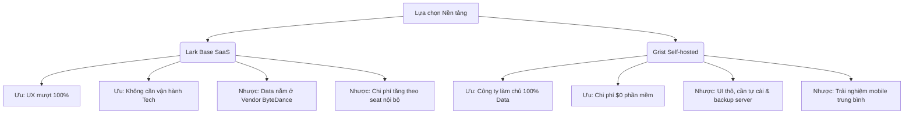

# Báo cáo Đề xuất Nền tảng Quản lý Doanh thu (Platform Recommendation)
> **Dự án**: PalFish GMV Reconciliation Automation
> **Tác giả**: Đạt 
> **Ngày thực hiện**: 12/06/2026
> **Bối cảnh**: Phân tích sơ bộ năng lực đáp ứng của các nền tảng đã qua bộ lọc sơ bộ trên 13 kịch bản nghiệp vụ cốt lõi. Báo cáo này so sánh điểm số chi tiết, nêu rõ ưu/nhược điểm kỹ thuật và đề xuất lộ trình chạy thử nghiệm thực tế (POC) tiếp theo cho anh Hiếu duyệt.
> 
> *Lưu ý quan trọng: Tài liệu này đại diện cho bước đánh giá sơ bộ (Preliminary Assessment) dựa trên tài liệu kỹ thuật chính thức của sản phẩm, phản hồi cộng đồng (community feedback) và năng lực danh nghĩa của nền tảng. Các chỉ số về độ mượt, khả năng chịu tải và phân quyền cần được xác nhận trực tiếp thông qua việc dựng thử nghiệm thực tế (POC) trên dữ liệu thật ở bước tiếp theo để kiểm chứng chính xác trước khi chốt giải pháp.*

---

## 1. Bảng Điểm Đánh giá Dự kiến (Estimated Scoring Matrix)

> [!NOTE]
> **Lưu ý về tính xác thực:** Điểm số dưới đây là **điểm số danh nghĩa (nominal score)** được đánh giá sơ bộ dựa trên tài liệu kỹ thuật của sản phẩm, thông tin tính năng công bố và các video demo của hãng. Do chưa chạy thử nghiệm thực tế (POC) trên dữ liệu 15.000 dòng thật nên các điểm số này có tính chất định hướng tiền đề, điểm số thực tế có thể thay đổi sau khi có bằng chứng thực tế nghiệm thu.

Dưới đây là bảng đánh giá dự kiến điểm số của các nền tảng dựa trên mẫu bảng so sánh và trọng số đã thống nhất tại mục 7 tài liệu handoff:

| Tiêu chí (trọng số) | Lark Base | Airtable | Teable (trên Supabase) | Grist (Self-host) | SeaTable (Self-host) | Google Sheets (baseline) |
| :--- | :---: | :---: | :---: | :---: | :---: | :---: |
| **UX worksheet W1–W10 (25%)** | 9.5 | 9.5 | 9.0 | 8.0 | 9.0 | 10.0 |
| **Phân quyền (20%)** | 9.5 | 5.0 | 9.0 | 10.0 | 7.5 | 2.0 |
| **Logic & automation (15%)** | 9.0 | 9.0 | 8.0 | 10.0 | 9.0 | 9.0 |
| **Kiểm soát data & lock-in (10%)** | 6.0 | 5.5 | 9.0 | 10.0 | 8.0 | 5.0 |
| **Báo cáo + export (10%)** | 10.0 | 9.5 | 7.5 | 9.0 | 9.0 | 9.5 |
| **Hiệu năng + migrate 15K dòng (10%)** | 9.5 | 9.5 | 9.0 | 9.0 | 8.5 | 6.0 |
| **Chi phí/năm — 10 editor + 40 viewer (5%)**| 9.0 | 6.0 | 10.0 | 10.0 | 4.0 | 10.0 |
| **API, tiếng Việt, mobile (5%)** | 9.5 | 9.5 | 8.0 | 7.5 | 8.0 | 9.0 |
| **Tổng** | **9.10** | **7.95** | **8.70** | **9.18** | **8.25** | **7.43** |
| **Hard gate fail?** | Không | Có | Không (Pass tạm thời) | Không | Không | Có |


---

## 2. Phân tích Chi tiết từng Ứng viên (Ưu & Nhược điểm)

### 2.1 Lark Base (Larksuite) — Lựa chọn SaaS Toàn diện Nhất
> [!NOTE]
> Phù hợp nhất nếu ưu tiên **trải nghiệm người dùng (UX) tối đa, thời gian đưa vào vận hành nhanh (time-to-market), tích hợp truyền thông nội bộ và không muốn tốn nguồn lực vận hành máy chủ.**

*   **Ưu điểm nổi bật (Ước tính từ tài liệu)**:
    *   **Trải nghiệm Worksheet (UX)**: Theo tài liệu sản phẩm và video demo, có dấu hiệu đáp ứng đầy đủ W1-W10. Thao tác inline edit nhanh, copy-paste block nhiều dòng từ Excel tự động giãn dòng, phím tắt undo/redo hoạt động tốt. Cố định (freeze) các cột đầu tiên trực quan. Cần xác nhận bằng POC thực tế.
    *   **Phân quyền nâng cao (Advanced Permissions)**: Cung cấp giao diện trực quan cho phép thiết lập RLS (Row-Level Security). Có khả năng thiết lập ma trận phân quyền: *System thấy tất cả; Manager thấy team mình; Leader/Sale thấy team + khối mình*. Hỗ trợ ẩn hoặc khóa hoàn toàn cột nhạy cảm (như GMV) đối với các role thấp.
    *   **Khả năng Migrate**: Lark Base hỗ trợ tính năng tạo linked records và import dữ liệu. Mức độ tự động map đúng quan hệ các trường danh mục (Sale/Kênh/Gói) khi import hàng loạt dữ liệu thô cần được kiểm chứng qua POC.
    *   **Ứng dụng Mobile**: Thừa hưởng app Lark Suite đồng bộ trên điện thoại, trải nghiệm xem đơn và sửa nhanh trên mobile vượt trội.
*   **Điểm yếu cần lưu ý**:
    *   **Vendor Lock-in**: Dữ liệu nằm hoàn toàn trên đám mây của ByteDance. Việc sao lưu tự động phải lập trình qua API để tải về hoặc xuất thủ công.
    *   **Chi phí phát sinh**: Cần xác nhận chính xác số seat trả phí. Nếu phân quyền viewer read-only bằng tài khoản Guest ngoài thì miễn phí, nhưng nếu dùng tài khoản Enterprise nội bộ sẽ tính phí $12/user/tháng trên tất cả user.
    *   **Giới hạn capacity**: Giới hạn record của Lark Base phụ thuộc plan/add-on; tài liệu Lark ghi các mốc 20K–50K records/table, muốn mở rộng cần xác nhận với sales/Account Executive. Vì vậy POC phải xác minh chính xác plan nào đủ 50K–100K records.

---

### 2.2 Grist (Self-hosted) — Lựa chọn Tối ưu cho Quản trị Dữ liệu & Chi phí
> [!TIP]
> Phù hợp nhất nếu công ty đặt nặng tiêu chí **kiểm soát dữ liệu 100% (như đang quản lý Supabase), bảo mật nội bộ tuyệt đối, ngân sách $0 bản quyền phần mềm và yêu cầu logic tính toán phức tạp.**

*   **Ưu điểm nổi bật (Ước tính từ tài liệu)**:
    *   **Công thức Python (Python Formulas)**: Grist sử dụng Python làm ngôn ngữ tính toán thay cho các hàm Excel thông thường, rất quen thuộc với lập trình viên. Công thức tính GMV động được viết trực quan:
        ```python
        gmv_rmb if rec.Date < datetime.date(2026, 6, 1) else rec.VND / rec.ExchangeRate
        ```
    *   **Phân quyền dòng mạnh mẽ nhất**: Sử dụng biểu thức Python để định nghĩa Access Rules ở mức độ bảng, dòng và cột. Có khả năng tái tạo hoàn hảo scope quyền: *System thấy tất cả; Manager thấy team mình; Leader/Sale thấy team + khối mình*. Rule này được áp dụng triệt để ở cấp cơ sở dữ liệu, kể cả khi truy vấn qua API.
    *   **Không lo Lock-in**: Toàn bộ cơ sở dữ liệu của một tài liệu Grist được lưu trữ dưới dạng một file SQLite đơn lẻ (`.grist`). Việc sao lưu dữ liệu đơn giản là tải file SQLite này về. File này có thể mở ngoại tuyến bằng công cụ Grist Desktop hoặc các trình đọc SQLite chuẩn.
*   **Điểm yếu cần lưu ý**:
    *   **Giao diện & UX**: UI thiết kế theo phong cách tối giản kỹ thuật, có phần khô khan hơn Lark Base. Việc cấu hình các widget báo cáo (dashboard layout) cần thời gian làm quen ban đầu. Giao diện mobile ở mức hiển thị được, thao tác sửa nhanh trên mobile có phần bất tiện.
    *   **Giới hạn phần cứng**: Bản self-host không có giới hạn dòng cứng từ phần mềm, giới hạn thực tế phụ thuộc RAM/CPU của server và độ phức tạp công thức. Báo cáo cộng đồng cho thấy Grist chạy mượt ở khoảng 100k-150k dòng nhưng cần máy chủ đủ mạnh.
    *   **Chi phí phát sinh trên Cloud**: Grist Cloud Pro giới hạn tối đa 2 Guests cộng tác bên ngoài miễn phí trên mỗi tài liệu. Với 40 viewers nội bộ, không thể dùng phương án guest miễn phí mà phải tính phương án an toàn là 50 paid seats (50 users × $8 × 12 = $4,800/năm), hoặc triển khai bản Self-hosted để tối ưu chi phí.

---

### 2.3 Teable (Self-hosted) — Lựa chọn Trung hòa (Postgres Airtable-clone)
> [!IMPORTANT]
> Đây là lựa chọn tiềm năng vì giao diện giống Airtable đến 90% nhưng hoạt động trên nền tảng cơ sở dữ liệu PostgreSQL. Tuy nhiên, nó bị đánh giá ở mức **Pass tạm thời (Conditional Pass)** do các rủi ro và mâu thuẫn kỹ thuật dưới đây.

*   **Ước tính từ tài liệu**:
    *   **Hiệu năng lớn**: Xử lý hàng trăm ngàn dòng dữ liệu mượt mà nhờ công nghệ lưu trữ Postgres được tối ưu hóa cho bảng biểu.
    *   **Giao diện Airtable**: Đẹp mắt, chuyên nghiệp, hỗ trợ kéo thả, nhóm dữ liệu (grouping) và lọc nhanh trực quan.
*   **Điểm yếu và các mâu thuẫn kỹ thuật cần xác minh**:
    *   **Tính năng và giới hạn self-host**: Teable Community/self-host chỉ được coi là conditional. Để có Authority Matrix/RLS và dung lượng sản xuất thực tế (capacity production), cần xác minh license self-host tương ứng; không được chốt chi phí chỉ bằng chi phí VPS trước khi thực hiện POC và kiểm tra điều khoản bản quyền (pricing chính thức của Teable giới hạn bản Free 1.000 dòng, Pro 250K dòng, Business $20/seat/tháng cho 1 triệu dòng và Authority Matrix nằm trong gói Business).
    *   **Khả năng kết nối Supabase**: Có mâu thuẫn kỹ thuật lớn cần làm rõ. Tài liệu handoff ghi nhận Teable có thể "đấu thẳng vào Supabase hiện tại". Tuy nhiên, theo kiến trúc của Teable, công cụ này tự quản lý schema, siêu dữ liệu (metadata) và cache riêng trên database Postgres của nó. Việc đấu thẳng vào một schema đang chạy sẵn của Supabase để đọc/ghi trực tiếp có rủi ro làm hỏng tính toàn vẹn dữ liệu hoặc ghi đè cấu trúc schema của Teable. Cần thiết lập chạy thử nghiệm (POC) để xác định chính xác khả năng tương thích.

---

## 3. Phân tích Trade-off Cốt lõi cho Quyết định Hướng đi

### Đánh đổi giữa 2 trường phái giải pháp
Anh Hiếu cần cân nhắc sự đánh đổi giữa hai luồng tư duy sau để đưa ra quyết định cuối cùng:



### Đánh đổi so với Ứng dụng tự code hiện tại (Trade-off hai chiều)
> [!WARNING]
> Việc chuyển sang SaaS (Lark Base) hoặc Self-host (Grist/Teable) giúp giải quyết triệt để bài toán RLS và UX Spreadsheet của đội Sales/Ops. Tuy nhiên, chúng ta sẽ mất đi khả năng tùy biến giao diện (UI) 100%. Cụ thể: không thể chèn logo PalFish, không thể tự cấu hình phối màu chuẩn theo thương hiệu (`#7260ff`), và không thể tích hợp trực tiếp các nút bấm webhook (như nút Remind kế toán xuất hóa đơn, nút kích hoạt CRM) thẳng vào thanh công cụ UI theo ý muốn mà phải phụ thuộc vào giao diện cấu hình có sẵn của nền tảng được chọn.

---

## 4. Khuyến nghị & Đề xuất Kế hoạch Hành động (Action Plan)

Dự thảo báo cáo sơ bộ đề xuất lộ trình kiểm chứng thực tế nhằm thu thập bằng chứng đầy đủ trước khi trình duyệt lên anh Hiếu:

### Bước 1: Dựng các Không gian Thử nghiệm (POC Workspaces)
1.  **Dựng Demo Lark Base**: Sử dụng bản dùng thử Pro, import thử dữ liệu, cấu hình thử Advanced Permissions (phân quyền dòng cho 1 account Sale, 1 account Manager) và kiểm tra tính năng xuất báo cáo.
2.  **Dựng Demo Grist (Self-hosted)**: Deploy bản Grist Core Docker lên máy chủ thử nghiệm, import dữ liệu tương tự, viết Access Rules bằng Python để phân quyền dòng và ghi lại log test.
3.  **Dựng Demo Teable**: Cài đặt Teable bản self-host, thử kết nối tới một database Postgres thử nghiệm để xác nhận khả năng kết nối và kiểm tra tính khả dụng của Authority Matrix.

### Bước 2: Chạy thực tế 13 Kịch bản Thử nghiệm (Dựa trên Handoff)
Mỗi nền tảng (Lark, Grist, Teable) sẽ được ép chạy qua 13 bài test thực tế với dữ liệu 15.000 dòng trích xuất từ database hiện tại. **Bằng chứng (Video/Screenshot, link demo thật, log hệ thống, kết quả import thật) phải được đính kèm đầy đủ cho từng mục để đảm bảo "Bằng chứng > Cảm nhận"**:

| Nhóm Test | ID | Kịch bản kiểm chứng (POC) | Tiêu chí Pass | Bằng chứng yêu cầu (Evidence Required) |
| :--- | :---: | :--- | :--- | :--- |
| **Dữ liệu** | 1 | Import 15K dòng + Map liên kết 4 bảng Master (Sale, Kênh, Gói). | Nhanh, không lỗi font Tiếng Việt, tự động map đúng liên kết thay vì làm tay. | - Ảnh màn hình/Video quá trình import.<br>- Log thời gian import.<br>- Ảnh chi tiết các trường linked records sau khi import. |
| | 5 | Cấu hình Formula tính GMV động (Rule trước/sau 01/06/2026). | Tính toán đúng 100% so với app hiện hành. | - Công thức chi tiết được cấu hình.<br>- Bảng kết quả so khớp giá trị tính toán trước và sau cutoff. |
| | 8 | Tự động cảnh báo dòng trùng lặp (Duplicate: UID + Ngày + Số tiền). | Báo lỗi hoặc highlight dòng vi phạm realtime. | - Ảnh chụp highlight cảnh báo trùng khi cố tình tạo dòng trùng dữ liệu. |
| **UX/UI** | 2 | Dựng Grid: Freeze 4 cột, dropdown Kênh/Gói, Date picker. | Giao diện gọn gàng, fit màn hình. | - Link demo sản phẩm.<br>- Ảnh chụp màn hình giao diện grid. |
| | 3 | Trải nghiệm W1-W10 (Đặc biệt: W5 Bulk edit, W6 Data validation). | Inline edit mượt, Paste khối từ Excel chuẩn xác. | - Video quay màn hình thao tác inline edit và bulk edit 10 dòng đồng thời.<br>- Video paste block 50 dòng từ Excel. |
| | 4 | Bộ lọc: Quick filter Chưa khớp NH/CRM, Search toàn văn, Lưu View cứng. | Khớp với logic filter của app pf-revenue hiện tại. | - Ảnh chụp kết quả filter 1 chạm và kết quả tìm kiếm đa trường. |
| **Bảo mật** | 6 | Giả lập 4 Role: Sale (thấy team), Manager (thấy team mình), Leader/Sale (team + khối), System. | RLS hoạt động triệt để ở cấp DB, ẩn được cột GMV với Sale. | - **Ảnh chụp màn hình/Video giao diện đăng nhập của 3 role khác nhau** hiển thị số lượng dòng và cột khác nhau dựa trên RLS. |
| | 9 | Test Conflict: 2-3 users cùng sửa một dòng/bảng. | Không bị ghi đè, hiển thị realtime. | - Video quay màn hình 2 trình duyệt đồng thời cập nhật dữ liệu realtime. |
| | 10 | Audit Log: Kiểm tra lịch sử chỉnh sửa từng ô. | Ghi nhận đúng User, Thời gian, Giá trị cũ/mới. | - Ảnh chụp bảng ghi lịch sử chỉnh sửa (audit history/cell history) của một ô dữ liệu. |
| **Vận hành** | 7 | Dựng Dashboard: BCTB Pivot, Tổng hợp Team/Kênh. | UI trực quan, Share link cho sếp (Read-only) ổn định. | - Ảnh chụp dashboard báo cáo.<br>- Link share read-only dùng thử. |
| | 11 | API & Backup: Thử xuất/nhập 1 record qua API, test Backup auto. | API response nhanh, tải bản backup mượt. | - Log curl test API hoặc screenshot Postman.<br>- File backup được tải về thử nghiệm. |
| | 12 | Trải nghiệm Mobile: Mở link trên điện thoại, sửa nhanh 1 ô. | Responsive tốt, không tràn viền vỡ layout. | - Video quay màn hình thao tác trên thiết bị di động thật. |
| | 13 | Exit Strategy: Export toàn bộ Base ngược ra file gốc. | Không mất quan hệ Linked Record. | - File Excel/CSV export ra từ hệ thống để kiểm tra tính toàn vẹn của dữ liệu và liên kết. |

### Bước 3: Họp Quyết định Hướng đi với anh Hiếu
Trình bày báo cáo kèm **đầy đủ bằng chứng thực tế thu thập được ở Bước 2** để anh Hiếu chốt chọn:
*   **Phương án A (Ưu tiên Trải nghiệm & Tốc độ)**: Chọn **Lark Base** (Tối ưu hóa chi phí dạng Guest Link).
*   **Phương án B (Ưu tiên Bảo mật & Làm chủ Dữ liệu)**: Chọn **Grist Self-hosted** (Vận hành máy chủ Docker riêng).
*   **Phương án C (Tích hợp sâu Postgres)**: Chọn **Teable Self-hosted** (Nếu POC chứng minh được tính an toàn schema và tính khả dụng của RLS miễn phí).
